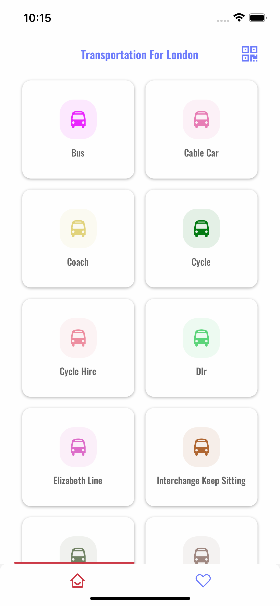
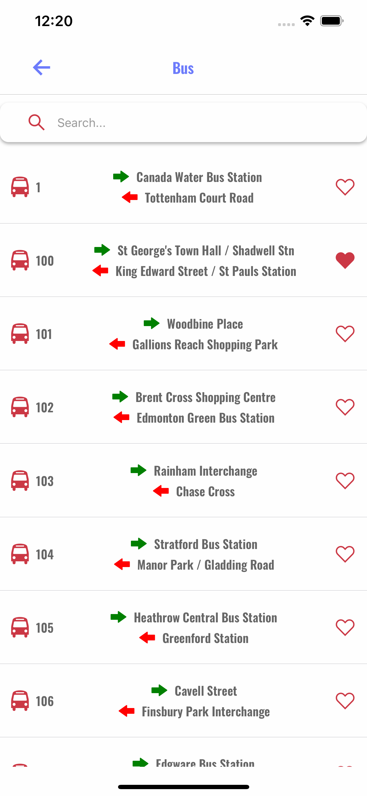
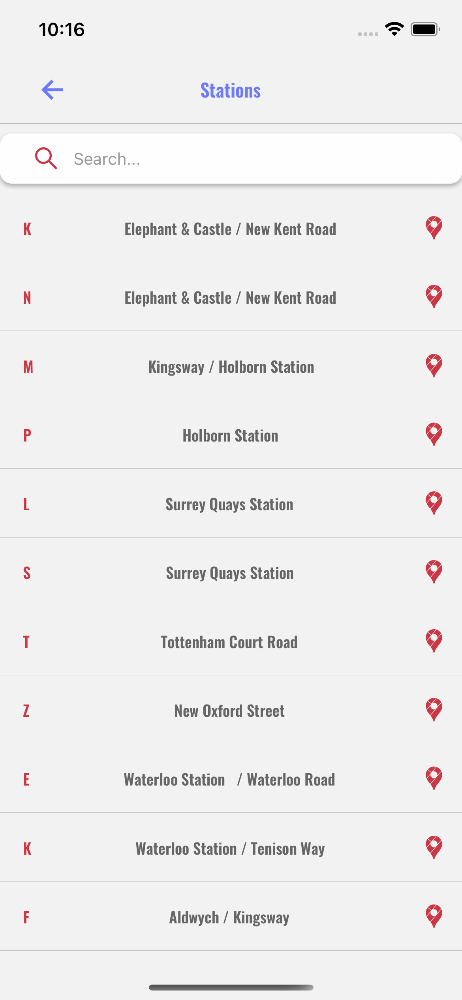
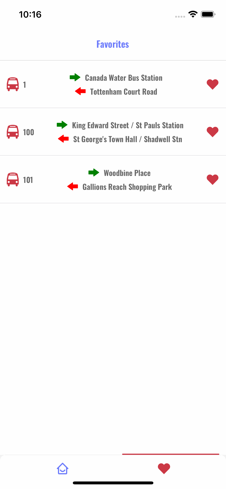
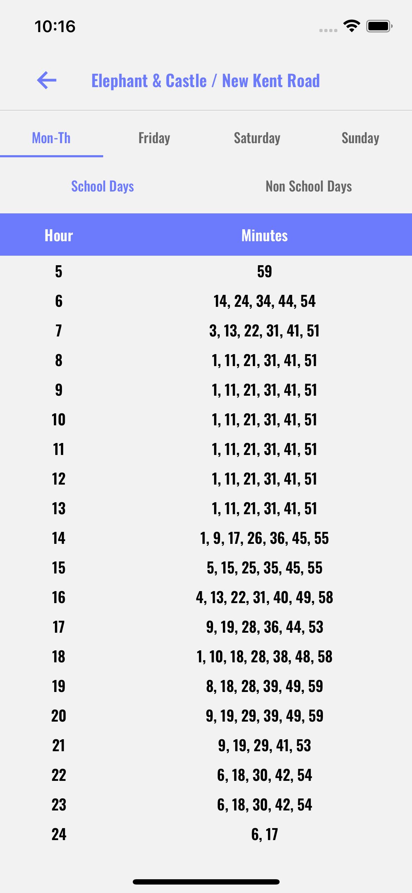

# transportation_london
## Getting started

`$ npm install --save`
 or
`$ yarn`

### For IOS 

`$cd ios && pod install`
`yarn ios`

### For Android 
#Link Fonts
`$react-native link`
`$yarn android`

### Home Screen

You can select a transportation mode from grid list view and then you will see the lines of selected mode. (Lines Screen)
At the top right of screen there is a QR Code Scanner button to scan qr which has properties lineId,fromStationId,toStationId,title.And then you can see time table of these given properties.From Time Table Screen.You can easily scan qr below this line.

### Lines Screen

You can see all lines of selected transportation mode from the list.

1-You can search by name.

2-You can change serviceType to Night or Regular from top right of screen.

3-You can add favorite lines to your local storage.And then you can see in Favorite Screen (Favorite Screen)

4-If you click one item from the list you will see all stations of this line. (Stations Screen)

### Stations Screen

You can see all stations of selected line.

1-You can search by common name of stations.

2-You can see the location if you click google-maps button at the right of list cards.

3-If you click one item from the list you will see time table of this station. (Time Table Screen)

### Favorite Screen

You can see all lines that you favorited.

1-You can delete favorites.

2-If you click one item from the list you will see all stations of this line. (Stations Screen)

### Time Table Screen

You can see time table of selected station.

You can select time zones from the swipeable screen.At Mon-Th and Friday tabs you can select School Days and Non School Days 

### Notes

Some lines and stations does not have any data in api so it only returns empty screen
